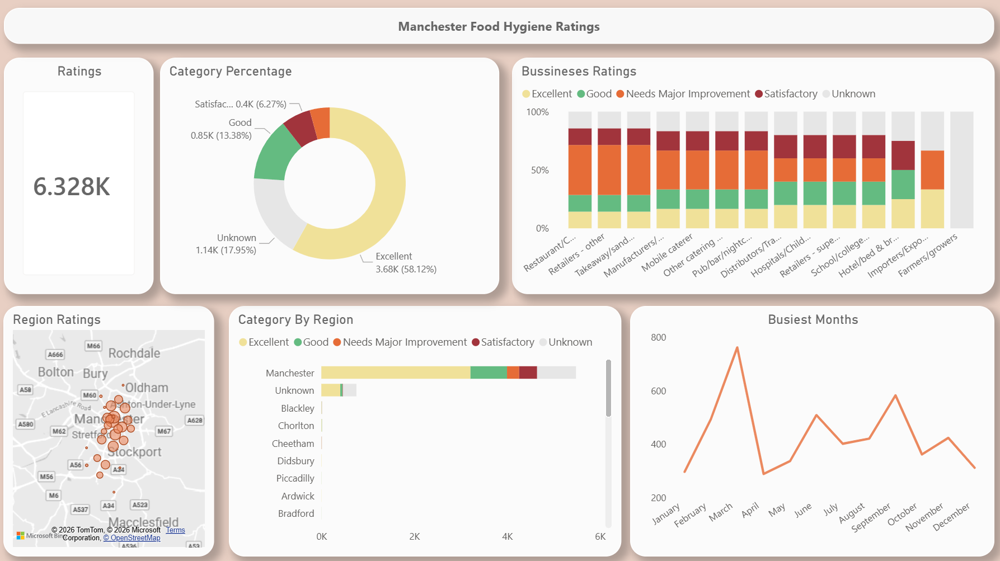
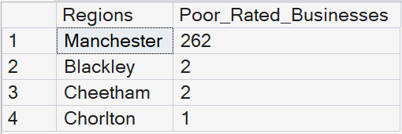
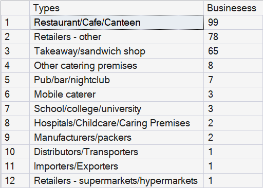
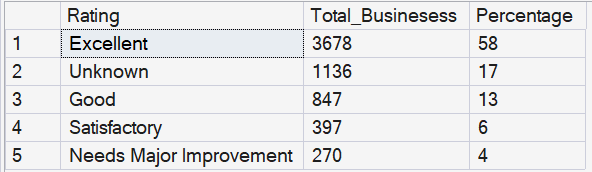
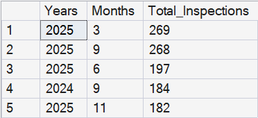
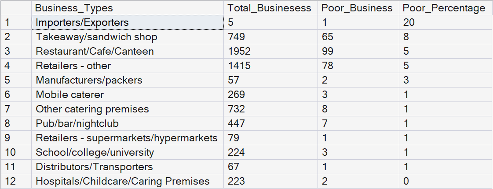
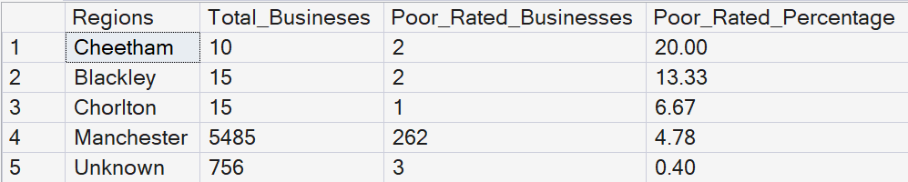
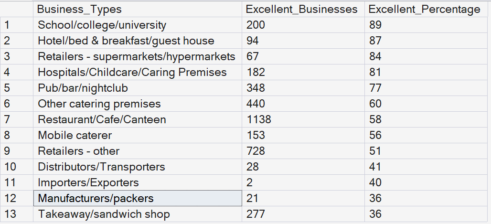
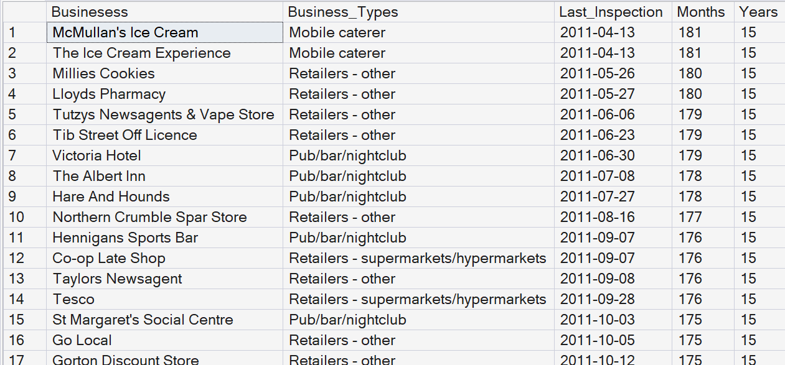

## Project Overview

A leading public health authority wants to better understand food hygiene standards across Greater Manchester in order to improve food safety, prioritise inspections, and reduce public health risks. The management team has noticed variations in hygiene ratings across business types, boroughs, and inspection outcomes, and wants to identify the factors contributing to lower food hygiene scores.

They are particularly interested in uncovering patterns related to business categories, geographical areas, inspection dates, and hygiene rating distributions to support more effective resource allocation and regulatory decision-making.

You are tasked with analysing the Food Standards Agency (FSA) food hygiene dataset to answer the following overarching business question:

“How can food hygiene rating data be leveraged to identify high-risk establishments, uncover regional trends, and support smarter inspection and public health strategies across Greater Manchester?”

## Project Workflow

1. Data Collection
2. Data Cleaning with Python
3. SQL Data Analysis
4. Insight Generation
5. Power BI Dashboard Visualisation
6. Business Recommendations

## Tools & Technologies

- Python (Pandas)
- SQL Server / SQL
- Power BI
- CSV / XML Data Processing
- VS Code

## Data Collection

The dataset was sourced from the UK Food Standards Agency (FSA) food hygiene rating dataset. The data contains information about food establishments across Greater Manchester, including business type, inspection results, hygiene ratings, inspection dates, and location data.

## Data Cleaning & Preparation

The raw dataset was cleaned and transformed using Python and Pandas before being imported into SQL Server.

Key cleaning steps included:

- Handling missing values and null entries
- Standardising column names and categorical values
- Converting date columns into datetime format
- Creating additional month and year columns for time analysis
- Removing duplicates and inconsistent records
- Converting numerical columns into appropriate data types

## SQL Database & Analysis

After cleaning, the dataset was imported into Microsoft SQL Server for exploratory data analysis.

SQL queries were written to:
- Identify high-risk regions
- Analyse hygiene ratings by business type
- Calculate percentage distributions
- Detect inspection trends over time
- Compare excellent vs poor performing businesses
- Identify establishments overdue for inspection

## Power BI Dashboard
The analysed data was visualised in Power BI to create interactive charts and dashboards that highlight trends, risk areas, and inspection activity across Greater Manchester.

## Key Insights

1. Which regions have the highest food hygiene risk?

2. Which business types have the worst hygiene ratings?

3. What proportion of businesses fall into each rating category?

4. Which months and years had the highest inspection activity?

5. Are certain business types more likely to receive poor ratings?

6. Which regions have the highest percentage of poorly rated businesses?

7. Which business types achieve the highest proportion of excellent ratings?

8. Which businesses have not been inspected for the longest time?

## Business Recommendations
Based on the analysis:

- Certain regions should receive increased inspection priority due to higher concentrations of poor hygiene ratings.
- Specific business categories may benefit from additional compliance monitoring and food safety education.
- Inspection scheduling could be optimised by focusing on historically high-risk periods and overdue establishments.
- Power BI dashboards can support faster decision-making and resource allocation for inspection teams.

